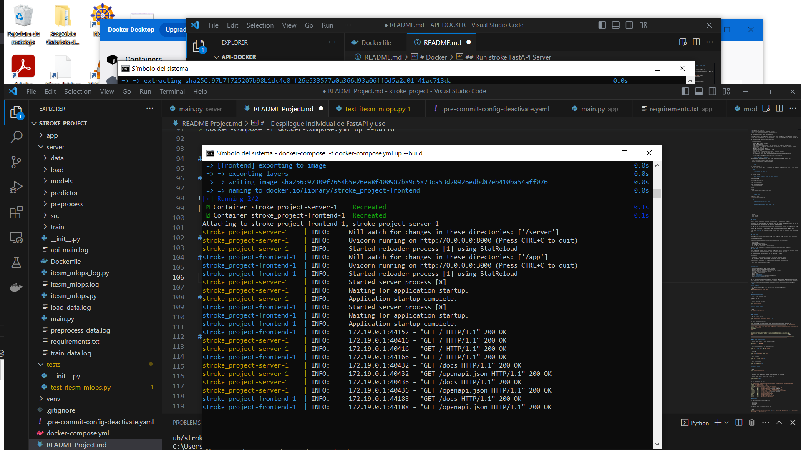
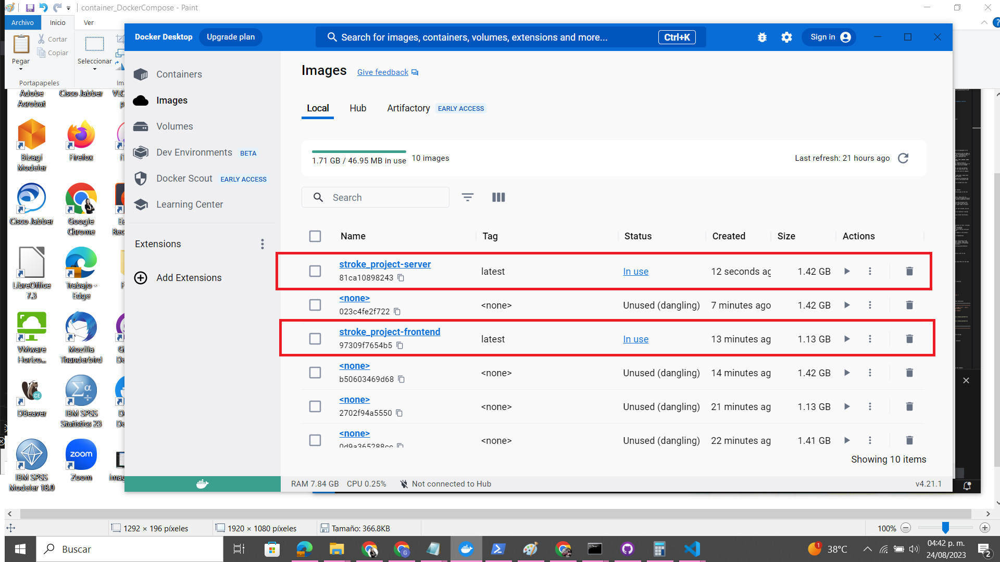
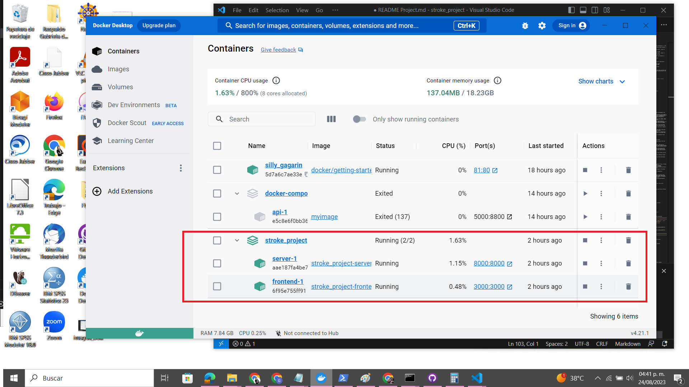
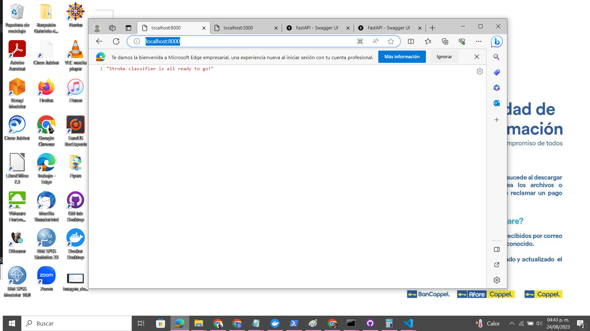
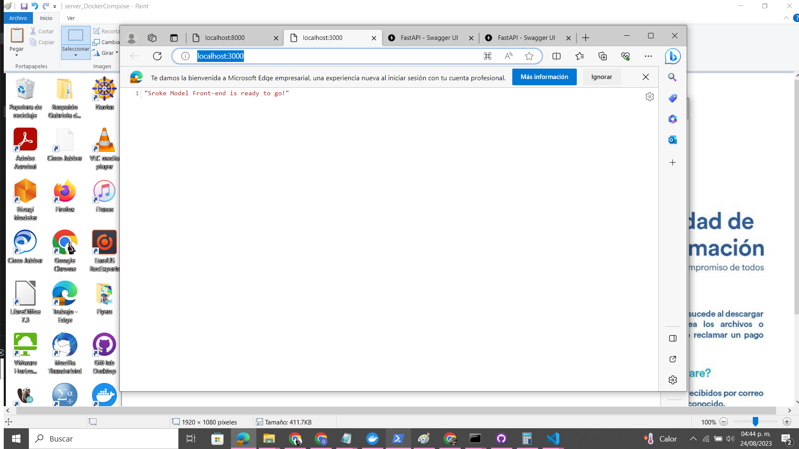
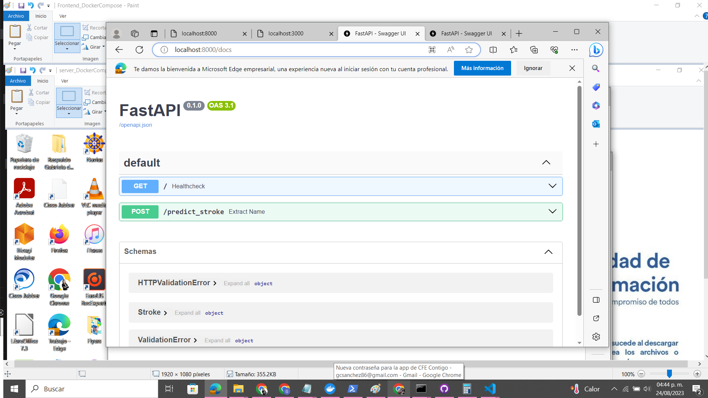
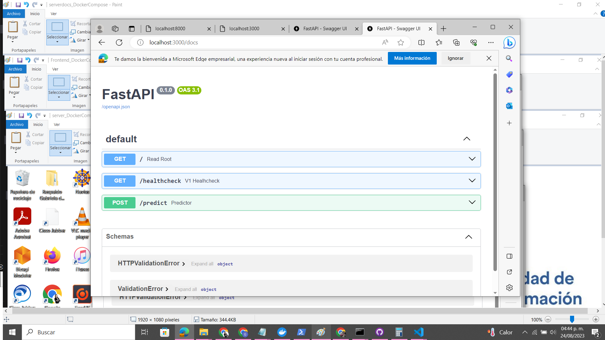

### Instructor: Carlos Mejia
### Student: Gabriela Sánchez

# Deliverable Module 4 - Project Stroke - DOCKER COMPOSE

In this deliverable, the following sections must be included:

# - Introduction of the project

"Stroke"

# - About the project

#    - Base line

The baseline (reference model) should be a simple model that acts as a comparison and is easy to explain. Also, the baseline must be based on the data set to create the actual model.

This deliverable identifies the nature of the dataset that has been assigned, and answers the following questions:

1. What problem does it address?
2. What solutions (notebooks) have you already developed?
3. Which of all the solutions contains the minimum necessary to
be able to train and save a model?

The problem it addresses is one of attack prevention:

According to the World Health Organization (WHO) stroke is the 2nd leading cause of death globally, responsible for approximately 11% of total deaths. This dataset is used to predict whether a patient is likely to get stroke based on the input parameters like gender, age, various diseases, and smoking status. Each row in the data provides relavant information about the patient.

The dataset is called: "healthcare-dataset-stroke-data"

* Attribute Information:

    - id: unique identifier
    - gender: "Male", "Female" or "Other"
    - age: age of the patient
    - hypertension: 0 if the patient doesn't have hypertension, 1 if the patient has hypertension
    - heart_disease: 0 if the patient doesn't have any heart diseases, 1 if the patient has a heart disease
    - ever_married: "No" or "Yes"
    - work_type: "children", "Govt_jov", "Never_worked", "Private" or "Self-employed"
    - Residence_type: "Rural" or "Urban"
    - avg_glucose_level: average glucose level in blood
    - bmi: body mass index
    - smoking_status: "formerly smoked", "never smoked", "smokes" or "Unknown"*
    - stroke: 1 if the patient had a stroke or 0 if not
    
    Note: "Unknown" in smoking_status means that the information is unavailable for this patient
    
    Reference: https://www.kaggle.com/fedesoriano/stroke-prediction-dataset

#    - Links to experiments as notebooks

There are multiple developed solutions, within which I particularly reviewed the following two:

- stroke-prediction-effect-of-data-leakage-smote.ipynb
- beginner-friendly-end-to-end-ml-project-enjoy.ipynb

The one I took as a base is the latest "beginner-friendly-end-to-end-ml-project-enjoy.ipynb".

#    - Scope

The scope of the model is:
- Take the dataset with the inputs to train a model that can predict the probability of having an attack considering some characteristics of the patients/people.

# Considerations

* Loggings
* Docker Compose

## Instructions:

### Loggings

Logs are essential in monitoring any system, and the deployment of ML models is no exception.

In this deliverable, the necessary Logging configuration must be added so that each module has its own logger and saves the corresponding logs in a file with the same name as the module, for example: train_data.py ->> train_data.log. In this way, each time modules and operations are instantiated, the records are saved to the file.

The logs must have different levels such as DEBUG, INFO, WARNING, ERROR and CRITICAL, according to what is being evaluated.

A good practice is to think about what kinds of things we want to validate that have happened, such as data being saved and assigning it to an INFO log level, or an exception where a model could not be loaded assigning an ERROR log level.

If you have a __init.py__ file in a folder, the .py files you define inside will be modules. Inside you should place the registration code.

IMPORTANT: Both the model logic and the API must have built-in logging.

Log files:

[Title](server/itesm_mlops_log.py) --> [Title](server/itesm_mlops.log)
[\[Title\](server/preprocess_data.log)](server/api_main.log)

### Docker Compose

Docker Compose helps us manage multiple containers. Among them are multiple machine learning model APIs, which will help us deploy different models and be able to choose which one we can redirect prediction traffic to.

In this deliverable, the goal is to build a front-end container that serves as a load-balancer to redirect prediction traffic and that can connect to another API container which has your model ready to predict.

Considerations:

- There must be at least two Dockerfiles: one for the frontend, and one for the API.
- A docker-compose.yml file
- When everything is deployed, there should be two containers running: frontend + api

In addition to the documentation from the previous Docker deliverable, you should include:

- How to deploy containers with docker-compose"

# - Setup

#    - Train the model from a main file

Model training is done from server folder:

run --> itesm_mlops.py

#    - Python version, packages to install and comands to execute

Install python 3.7
Install python 3.10

Install Requirements_venv.txt

Create virtual environment:
> py 3.10 -m venv venv

Access to virtual enviroment:
> venv\scripts\activate.bat 

Execute:
> uvicorn main:app --reload

Execute:
> docker-compose -f docker-compose.yml up --build

# - Execution of unit tests (pytest)

#    - Links to tests

In process... build
[Title](tests/test_itesm_mlops.py)

# - Uso

